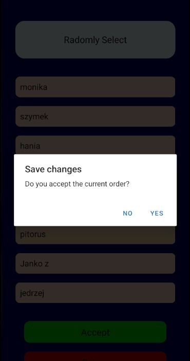

# 🏔️ Mountain Guide Selector

A mobile application built with React Native that helps randomly select a mountain guide to lead a group during hiking trips.

## About the App

Mountain Guide Selector is a simple and intuitive mobile app designed to support Guide Associations during guide trainings.
It allows users to fairly and randomly choose a guide from a predefined list of participants.

The app ensures quick decision-making and eliminates bias when selecting who leads the group.

## Features

- Add guides to the list
- Remove guides
- Randomly select a guide from the list
- Display the list of participants
- Clean and user-friendly interface

## Tech Stack

- React Native
- Expo
- JavaScript
- React Hooks

## Screenshots
### Home Screen
Home Screen of the app. There are three buttons allowing the user to enter the list of guides, 
randomly select the order and display the actual order of the list. 

  

### Enter Names
Here the user can add the participants of the hiking group. Additionally at the button of the page
there are: one button to delete the current list and one to return to the home page.

  

### Choose the order
Here the user is able to randomly choose the order of participants. 

  

By pressing 'Accept' the following Alert is going to pop-up asking the user if the changes should be saved. 
After accepting the list is going to be visible in the currrent list.

  
  

### Current List
Here appears the list after randomizing.

  

## Author
Andrzej Nowak
GitHub: https://github.com/NowakAndrzej283

## License
This project is licensed under the MIT License

